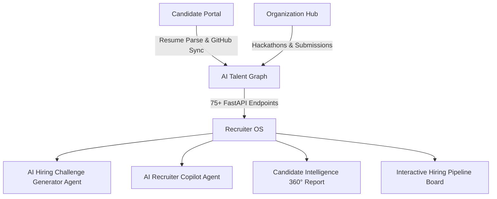

# ApexTalent AI — Autonomous AI Hiring & Talent Operating System

ApexTalent AI is an end-to-end AI-powered hiring operating system bridging **Candidates (Supply Side)**, **Organizations & Hackathons (Community Side)**, and **Recruiters (Demand Side)** with autonomous AI agents, multidimensional scoring, anti-fraud telemetry, and real-time interview evaluation.

---

## 🌟 Core System Architecture



---

## 📦 Key Capabilities Delivered Across Sprints 1–4

### 1. Candidate Platform (Supply Side)
- **AI Resume Parser**: Extracts skills, experience, and projects from PDFs to compute baseline talent match scores.
- **GitHub Repository Telemetry Sync**: Analyzes commit volume, PR frequency, language distribution, and repo code quality.
- **AI Mock Interview Studio**: Interactive voice/text technical interview engine evaluating answer accuracy, communication, and problem-solving.
- **Career Roadmap & Skill Gap Analyzer**: Generates targeted learning milestones and recommended certifications.

### 2. Organization & Community Platform (Community Side)
- **Hackathon & Event Hosting Studio**: Host end-to-end hackathons with track management and prize allocations.
- **AI Team Builder Agent**: Auto-assembles balanced hackathon teams based on complementary skill graphs.
- **Submission Evaluator & Leaderboards**: Automated rubric scoring for project repositories, pitch decks, and live demos.
- **GitHub Contribution Reports**: Generates granular commit ownership metrics and collaboration scores per team member.

### 3. AI Services & Anti-Fraud Infrastructure
- **Multidimensional Talent Score**: 0–100 score computed across Coding, Innovation, Leadership, Communication, Community, and Consistency.
- **Authenticity & Fraud Detector**: Anti-plagiarism verification layer cross-referencing repository history and submission code patterns.
- **Semantic Candidate Search**: Natural language candidate search (`POST /api/v1/recruiter/candidate-search`).

### 4. Recruiter Operating System (Demand Side - Sprint 4)
- **AI Hiring Challenge Generator Agent**: Generates custom coding, backend, and ML challenges with problem statements, deliverable checklists, rubric weights, and test cases (`POST /api/v1/recruiter/challenge/generate`).
- **AI Recruiter Copilot Agent**: Conversational assistant capable of side-by-side candidate comparisons (Candidate A vs Candidate B), fair market salary range predictions, tailored technical interview questions, and talent shortlisting (`POST /api/v1/recruiter/copilot/chat`).
- **Candidate Intelligence 360° Report**: Deep telemetry report covering Talent Score radar, verified badges, repository analytics, PPT/pitch evaluation scores, and authenticity index (`GET /api/v1/recruiter/candidate/{id}/intelligence`).
- **Interactive Hiring Pipeline Board**: 6-stage Kanban board tracking candidates across `Applied` → `AI Reviewed` → `Challenge` → `Interview` → `Offer` → `Hired` with instant candidate notifications (`POST /api/v1/recruiter/pipeline/update-stage`).

---

## 🛠️ Technology Stack

- **Backend**: Python 3.12, FastAPI, SQLAlchemy, PostgreSQL, Redis, PyTest.
- **Frontend**: Next.js 15 (App Router), TypeScript, Tailwind CSS, Lucide Icons, Recharts.
- **Containerization**: Docker, Docker Compose.

---

## 🚀 Quick Start Guide

### Running with Docker Compose
```bash
docker-compose up --build
```
- **Frontend Application**: [http://localhost:3000](http://localhost:3000)
- **FastAPI Backend Swagger Docs**: [http://localhost:8000/docs](http://localhost:8000/docs)
- **Database Adminer**: [http://localhost:8080](http://localhost:8080)

### Running Locally without Docker

#### 1. Backend Setup
```bash
cd backend
python -m venv venv
# On Windows:
.\venv\Scripts\activate
# On Linux/macOS:
source venv/bin/activate

pip install -r requirements.txt
uvicorn app.main:app --reload --port 8000
```

#### 2. Frontend Setup
```bash
cd frontend
npm install
npm run dev
```

---

## 🧪 Testing Backend Services
```bash
cd backend
python test_sprint4.py
```
Outputs:
```text
=== Testing AI Hiring Challenge Generator Agent ===
✅ AI Hiring Challenge Generator Agent passed!

=== Testing AI Recruiter Copilot Agent (Candidate Comparison) ===
✅ AI Recruiter Copilot (Comparison) passed!

=== Testing AI Recruiter Copilot Agent (Salary Prediction) ===
✅ AI Recruiter Copilot (Salary Prediction) passed!

=== Testing AI Recruiter Copilot Agent (Interview Questions) ===
✅ AI Recruiter Copilot (Interview Questions) passed!

✨ All Sprint 4 agent service tests completed successfully!
```
